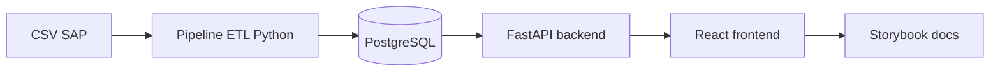
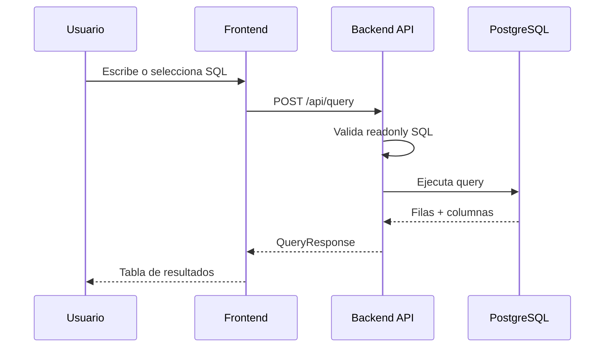

import { Meta } from "@storybook/addon-docs/blocks";

<Meta title="01. Documentacion/Introduccion" />

# TEG SQL Explorer

TEG SQL Explorer es una interfaz para validar datos del ETL SAP y explorar informacion del warehouse en PostgreSQL.

## Objetivo

- Ejecutar consultas SQL de solo lectura desde frontend.
- Inspeccionar schema y tablas disponibles.
- Reutilizar consultas preconfiguradas para auditoria y QA.
- Documentar arquitectura tecnica y flujo operativo.

## Arquitectura general

## Flujo de consulta en la aplicacion

## Componentes principales

| Componente | Ubicacion | Rol |
| --- | --- | --- |
| `SqlEditor` | `frontend/src/components/SqlEditor.tsx` | Editor SQL y ejecucion con `Ctrl+Enter` |
| `ResultsTable` | `frontend/src/components/ResultsTable.tsx` | Render de metadatos y filas retornadas |
| `SchemaPanel` | `frontend/src/components/SchemaPanel.tsx` | Navegacion de tablas y vistas por schema |
| `QueryPresets` | `frontend/src/components/QueryPresets.tsx` | Biblioteca de consultas de analisis |

## Dominios de documentacion en este Storybook

- `Documentacion`: arquitectura, schema, ETL, API y setup.
- `Componentes`: stories funcionales de la UI real del proyecto.
