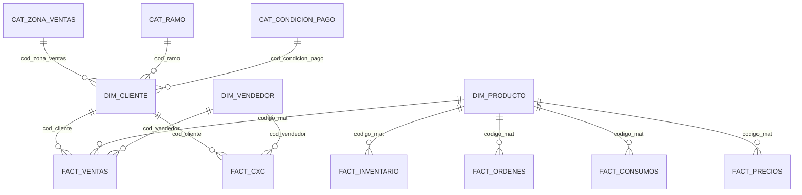

import { Meta } from "@storybook/addon-docs/blocks";

<Meta title="01. Documentacion/Schema de BD" />

# Schema de Base de Datos

Fuente principal: `sql/schema.sql`.

## Esquemas funcionales

| Schema | Proposito |
| --- | --- |
| `cat` | Catalogos maestros SAP (codigos y descripciones) |
| `dim` | Dimensiones de negocio (cliente, producto, vendedor) |
| `fact` | Hechos transaccionales (ventas, cxc, cxp, pedidos, inventario, produccion) |
| `raw` | Auditoria de payload original en texto/JSONB |
| `etl` | Control de ejecuciones, rechazos y estado de pipeline |

## Relaciones clave

## Notas de modelado

- Varias FKs en `sql/schema.sql` estan documentadas como comentarios `/* REFERENCES ... */` para mantener flexibilidad de carga.
- La integridad se refuerza por reglas de ETL: idempotencia, placeholders y normalizacion de codigos.
- Tablas `fact.*` incluyen `line_hash` unico para detectar cambios por fila.

## Tablas fact mas usadas para analitica

| Tabla | Grano | Llaves de negocio |
| --- | --- | --- |
| `fact.ventas` | Linea de factura | `num_factura + cod_cliente + codigo_mat + fecha_doc` |
| `fact.cxc` | Documento de cobranza | `n_documento + cod_cliente + cod_clase_doc + asignacion` |
| `fact.cxp` | Documento de proveedor | `n_documento + proveedor + clase_doc + asignacion` |
| `fact.pedidos` | Linea de pedido | `doc_comer + num_pedido + codigo_mat` |
| `fact.inventario` | Snapshot por material/centro/almacen | `codigo_mat + centro + almacen + tipo_inv` |

## Vistas utilitarias

- `etl.estado`: ultimo estado de cada fuente cargada.
- `fact.v_ventas_full`: ventas con joins a dimensiones y catalogos.
- `fact.v_cxc_full`: cobranza enriquecida.
- `fact.v_inventario_disponible`: stock libre/calidad consolidado.
