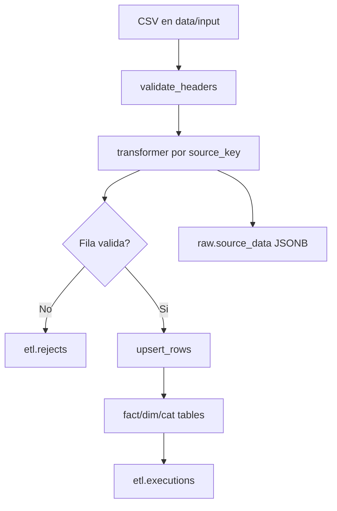

import { Meta } from "@storybook/addon-docs/blocks";

<Meta title="01. Documentacion/Pipeline ETL" />

# Pipeline ETL

Fuente principal: `etl/pipeline.py` y `etl/config/sources.py`.

## Flujo operacional

1. Cargar catalogos (`cat.*`).
2. Cargar dimensiones: `dim.vendedor`, `dim.producto`, `dim.cliente`.
3. Cargar hechos en orden `FACT_LOAD_ORDER`.
4. Cargar historico raw (`raw.ventas`, `raw.clientes`, `raw.source_data`).

## Diagrama de proceso



## Idempotencia y reproceso

- Hash MD5 por archivo evita reprocesar archivos identicos.
- `line_hash` por fila detecta cambios incrementales.
- `--reset-hash <SOURCE>` forza reprocesamiento controlado.
- `--dry-run` valida parseo/headers sin escribir en BD.

## Orden de carga de hechos

`PHXX -> AVPH -> AVAC -> NEXFAC -> PEDIDOSFULL -> PEDIDOS -> INVPT -> INVPT_GENERAL -> INVMP -> O_PH -> O_HG -> O_PM -> C_PH -> C_HG -> N_PH -> PRECIOS`

## Comandos utiles

```bash
# Ejecucion completa
python etl/pipeline.py --dir data/input

# Solo una fuente
python etl/pipeline.py --dir data/input --source PHXX

# Validacion sin escritura
python etl/pipeline.py --dir data/input --dry-run

# Reprocesar una fuente
python etl/pipeline.py --reset-hash PHXX
```

## Evidencia operativa recomendada

- Guardar salida de `etl.executions` por corrida.
- Auditar rechazos en `etl.rejects` (top 200 por ejecucion).
- Revisar `etl.estado` antes de abrir dashboards o ejecutar QA SQL.
